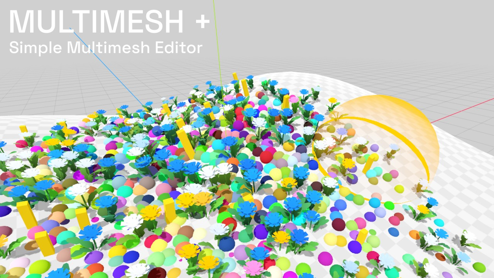

# Multimesh +

The aim of this project is to explore minimal editing functionality for the `MultiMeshInstance3D` node. Please note that this plugin is still in the very early stages of development. As such, I cannot guarantee that it will work properly on your project.

## Features

Add, delete, scale, and paint. MM+ is designed to facilitate the editing of multimesh instances and divide them on a grid for 3D culling.

### MMPlus3D node

To use the plugin, add a `MMPlus3D` node in your scene and populate the data block array in the inspector. 

- The data block array must contain valid `MMPlusData` resources with a valid `MMPlusMesh` subd resource.

- `MMPlusData` resources should not be used across different `MMPlus3D` nodes, as they contain all the raw information (multimesh buffers).

- `MMPlusMesh` resources can be saved and used in multiple `MMPlus3D` nodes.

### Modes

By default, no mode is active, so make sure to select one in the top menu bar to use the node.
Also, make sure to have at least 1 valid MMPlusData resource in the node's data block.

#### Paint Mode

Use `left click` to add and `left click + shift` to erase items.

#### Scale Mode

Use `left click` to scale up and `left click + shift` to scale down.
Use `left click + CTRL` to restore to base scale.

#### Paint Mode

Use `left click` to apply the selected color to items, and use the randomize toggle to randomize the applied color.

### Shortcuts

#### Brush size shortcut

`left shift + S + mouse scroll wheel` to increase or decrease the current mode brush size.

### Known Issues

- A mismatch between the `MultiMeshPlus3D` node data block and the plugin can happen.
	- Make sure your data block doesn't contain empty entries.
	- Deselect and reselect the `MultiMeshPlus3D` node to force plugin update.
- The Undo / Redo feature can be a bit buggy sometimes.
