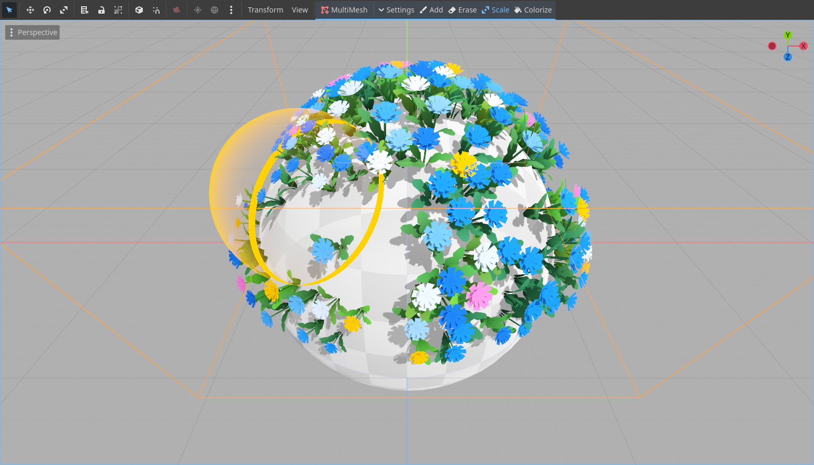

# Multimesh +

The aim of this project is to explore minimal editing functionality for the `MultiMeshInstance3D` node. Please note that this plugin is not ready or intended for production, as it is a naive implementation of what such a tool could be. 
