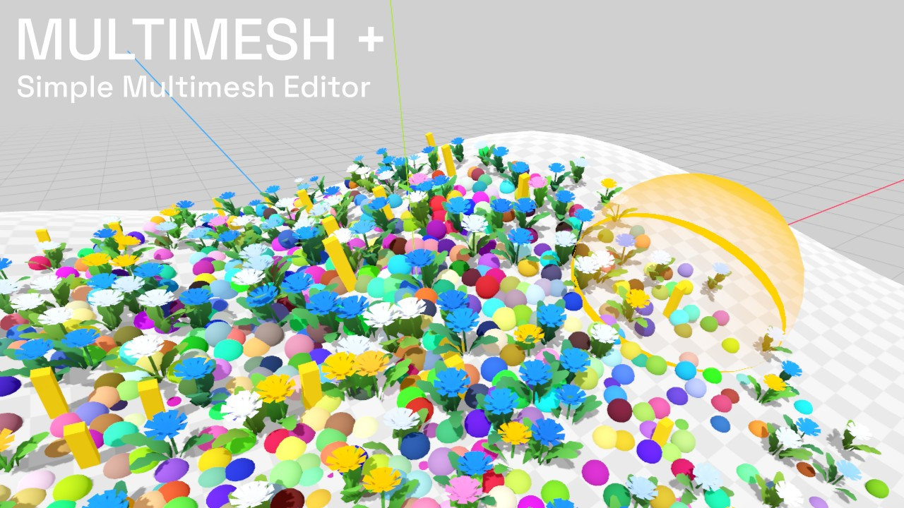

# Multimesh +

The aim of this project is to explore minimal editing functionality for the `MultiMeshInstance3D` node. Please note that this plugin is still in the very early stages of development. As such, I cannot guarantee that it will work properly on your project.

## Features

### MMPlus3D node

To use the plugin:
1. Add a `MMPlus3D` node in your scene.
2. Create a `MMPlusDataGroup` in the inspector.
3. Populate the `items` section with `MMPlusMesh` resources.

Tips:

- `MMPlusMesh` resources can be saved and used in multiple `MMPlus3D` nodes.
- `MMPlusDataGroup` holds all the buffer information. For a low amount of placed items, it's fine to keep it embedded in the scene, but you can save these resources in `.res` format to save space if needed.

### Resources

MM+ uses multiple custom resources and objects internally, but a few are actually meant to be used directly.

#### MMPlusMesh

`MMPlusMesh` refers to the visual instance that you can place, as well as the rules governing its placement.

These resources can be dragged and dropped into the `items` section when selecting an `MMPlus3D` node.

#### MMPlusDataGroup

`MMPlusDataGroup` contains all the buffers of your placed items. You must define one in the inspector when selecting an `MMPlus3D` to edit and store anything. You can keep this resource embedded in a scene or save it as a `.tres` or `.res` external resource.

### Modes

At its core, MM+ is a multimesh transform editing tool. You can currently switch between 3 editing modes (Paint, Scale, and Color).

By default, no mode is active, so make sure to select one in the top menu bar to use the node.

ℹ️ Make sure to set a `MMPlusDataGroup` resource in the inspector and to have at least 1 `MMPlusMesh` resource in the tool's `Items` section to be able to use the plugin.

#### Paint Mode

Use `left click` to add and `left click + shift` to erase items.

#### Scale Mode

Use `left click` to scale up and `left click + shift` to scale down.
Use `left click + CTRL` to restore to base scale.

#### Color Mode

Use `left click` to apply the selected color to items, and use the randomize toggle to randomize the applied color.
ℹ️ Only `MMPlusMesh with `DataMode` set to `Transform and Vertex Color` can store color data and be affected by the color mode.

### Shortcuts

#### Brush size shortcut

`left shift + S + mouse scroll wheel` to increase or decrease the current mode brush size.

### Known Issues

- The Undo / Redo feature can be a bit buggy sometimes.

